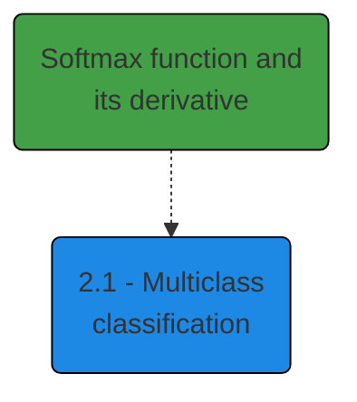

# Contents - Classification

```mermaid
---

---
flowchart TD
    c1(2.1 - Multiclass
classification)
    m1(Softmax function and
its derivative)

m1:::math -.-> c1:::model

classDef model fill:#1E88E5,stroke:#000,stroke-width:1px
classDef math fill:#43A047,stroke:#000,stroke-width:1px
```
