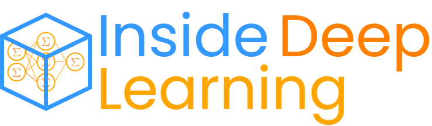

 <br>


<p align="center">
<picture>
   <source media="(prefers-color-scheme: dark)" srcset="images/inside-deep-learning-logo.png" width="500">
   
</picture>
</p>

This repository is a collection of Jupyer notebooks aimed at exploring the vast field of machine learning. Sometimes it is difficult to find implementations of important concepts or ideas, so here we try to implement and explain those ideas using Markdown and PyTorch. 

This repository is not intended for beginners or LMs lovers. Rather, it is a compilation of notes on all possible ML topics, especially DL 🧠.

> [!NOTE]
> Some formulas in $\LaTeX$ may not render well on Github.

> [!TIP]
> All notebooks are supported for Colab and Jupyter NBViewer.

## Table of Contents

1. [Linear regression 📈](1-linear-regression)
    1. 🤖 [Simple linear regression](1-linear-regression/1-1-simple-linear-regression.ipynb)
    2. 🤖 [Multivariate linear regression](1-linear-regression/1-2-multivariate-linear-regression.ipynb)
    3. 🤖 [Weight decay (L2 regularization)](1-linear-regression/1-3-weight-decay.ipynb)
    + ➗ [Weight decay and Normal equation](1-linear-regression/weight-decay-and-normal-equation.ipynb)
2. [Classification 📊](2-classification)
    1. 🤖 [Multiclass classfication](2-classification/2-1-multiclass-classification.ipynb)
    + ➗ [Softmax function and its derivative](2-classification/softmax-function-and-its-derivative.ipynb)
3. [Multilayer Perceptron 🧠](3-multilayer-perceptron)
    1. 🤖 [Multilayer perceptron (MLP)](3-multilayer-perceptron/3-1-mlp.ipynb)
    + ➗ [Gradients and activation functions](3-multilayer-perceptron/gradients-and-activation-functions.ipynb)
    + 🔵 [MLP for classification](3-multilayer-perceptron/mlp-for-classification.ipynb)
    + 🔵 [MLP like PyTorch](3-multilayer-perceptron/mlp-like-pytorch.ipynb)
  
> [!TIP]
> 🤖 Programming ML models.
> ➗ Focus on specific concepts, such as mathematics.
> 🔵 Minor variations on the main topics.

## How to Use

1. Clone the repository:
   ```
   git clone https://github.com/PilotLeoYan/inside-deep-learning.git
   ```
2. Create environment: <br>
  Inside Deep Learning is written in `python=3.14.0`. We recommend using Conda to manage dependencies.
   ```
   conda create --name idl -y python=3.14.0
   conda activate idl
   pip install --upgrade pip
   cd inside-deep-learning
   ```
3.
   A. Install dependencies with cuda:
   ```
   pip install -r requirements-cuda.txt
   ```
   B. Install dependencies without cuda:
   ```
   pip install -r requirements.txt
   ```

## Used Hardware

* CPU: AMD Ryzen 7
* GPU: Nvidia Geforce RTX 2070-SUPER (8GB VRAM)
* RAM: 16GB DDR4

## Contributing

Contributions are welcome! If you have suggestions, improvements, or new topics to add, feel free to open an issue. Please follow the [contributing guidelines](CONTRIBUTING.md).
Remember that I am only one person working on this repository.

If you find this repo useful, please star (★) this repo or cite using the following bibtex entry:
```
@misc{pilotleoyan25idl,
  title={Inside-Deep-learning},
  author={Rivera, Leonardo Fabyan Ortega},
  publisher = {GitHub},
  journal = {GitHub repository},
  howpublished={\url{https://github.com/PilotLeoYan/inside-deep-learning}},
  year={2025}
}
```

## Star History

<a href="https://www.star-history.com/#PilotLeoYan/inside-deep-learning&Date">
 <picture>
   <source media="(prefers-color-scheme: dark)" srcset="https://api.star-history.com/svg?repos=PilotLeoYan/inside-deep-learning&type=Date&theme=dark" />
   <source media="(prefers-color-scheme: light)" srcset="https://api.star-history.com/svg?repos=PilotLeoYan/inside-deep-learning&type=Date" />
   
 </picture>
</a>

## Main Bibliography

<a id="1">[1]</a> 
**Goodfellow, I., Bengio, Y., & Courville, A.** (2016). *Deep Learning*. MIT Press. [URL](http://www.deeplearningbook.org).

<a id="2">[2]</a> 
**Zhang, A., Lipton, Z. C., Li, M., & Smola, A. J.** (2023). *Dive into Deep Learning*. Cambridge University Press. [URL](https://D2L.ai).

<a id="3">[3]</a> 
**Deisenroth, M. P., Faisal, A. A., & Ong, C. S.** (2020). *Mathematics for Machine Learning*. Cambridge University Press. [URL](https://mml-book.github.io/).

---

If you would like to contact me you can send me an [email](mailto:leofabyano@gmail.com).
