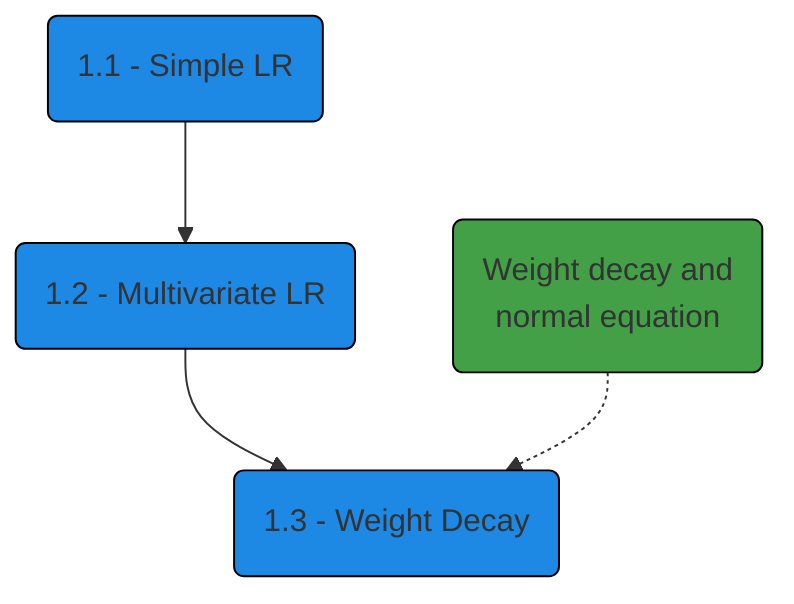

# Linear Regression

```mermaid
---

---
flowchart TD
    c1(1.1 - Simple LR)
    c2(1.2 - Multivariate LR)
    c3(1.3 - Weight Decay)
    m1(Weight decay and
normal equation)

c1:::model --> c2
c2:::model --> c3:::model

m1:::math -.-> c3

classDef model fill:#1E88E5,stroke:#000,stroke-width:1px
classDef math fill:#43A047,stroke:#000,stroke-width:1px
```
