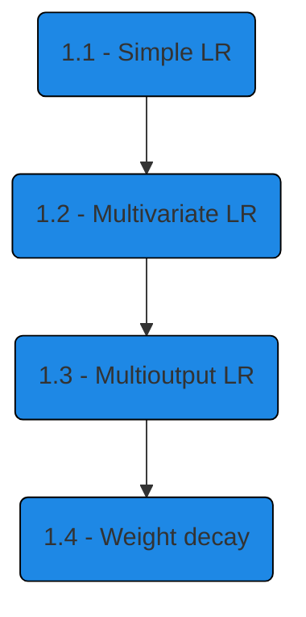

# Linear Regression

## Contents

## Introduction

In this chapter, we will look at the basic unit for Artificial Neural Networks (ANN), 
the Perceptron. We will explore and program different versions of the Perceptron from scratch, 
increasing the complexity of the problem in each part.

In general, the problem to be solved is to approximate the *true function* $f(\cdot)$  that maps the input data to the output data using the linear function $\hat{f}(\cdot)$ estimated based on the *training data*.

## Parts

### Simple LR

This is the easiest problem to solve in linear regression. We will have a single input feature and a single output feature

$$
\mathbf{y} = f(\mathbf{x}) + \epsilon
$$

also establish important concepts such as *dataset* (and its partitions) $\mathcal{D}$, 
*loss function* $L$, 
use of *gradients* to update parameters, etc.

### Multivariate LR

Based on the previous section, 
we increase the complexity of the problem by increasing the number of input features

$$
\mathbf{y} = f(\mathbf{X}) + \epsilon
$$

which makes calculating gradients a little more complicated.

### Multioutput LR

Finally, the number of output features is increased here

$$
\mathbf{Y} = f(\mathbf{X}) + \epsilon
$$

which sets the stage for moving on to the next chapter.

### Weight Decay

We do not increase the complexity of the problem, 
but rather introduce new concepts such as *objective function* $J$, *regularization*, etc

$$
J(\hat{\mathbf{Y}}, \mathbf{\theta}) = 
L(\hat{\mathbf{Y}}) + \text{regularization}(\theta)
$$

## Recommendations

We recommend following the chapters in order, because each part uses concepts/formulas from the previous part. So if you get lost because of an assumed topic/formula, it was probably developed earlier.

If you encounter any problems, feel free to send us an email (the address can be found on the home page of this repository) or use the **Issues** button at the top.