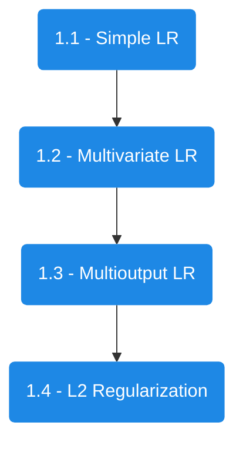

# Linear Regression

As the first chapter of this project, we consider it appropriate to address the problem of **linear regression** using a single neuron, or *perceptron*. Throughout this chapter and the following ones, we will use the term “perceptron” interchangeably with “linear regression” and “linear unit”.
But why start with linear regression? 

```{figure} ../figures/chapter1/linear-approx.png
:width: 60%
:align: center
```

We start here because it establishes the theoretical framework for our work. Assuming a linear relationship between the variables, we can design the most fundamental model to work with.

$$
\hat{y} = b + w_{1} x_{1} + w_{2} x_{2}
$$

We cannot know the true relationship or distribution of the data, but we can make good approximations. 

## Sections

<div style="display: flex; justify-content: center;">


```mermaid
flowchart TD
    c1(1.1 - Simple LR)
    c2(1.2 - Multivariate LR)
    c3(1.3 - Multioutput LR)
    c4(1.4 - L2 Regularization)

c1:::model --> c2
c2:::model --> c3
c3:::model --> c4:::model

classDef model fill:#1E88E5,color:#FFF,stroke:none,stroke-width:0px
classDef math fill:#43A047,color:#FFF,stroke:none,stroke-width:0px
```

</div>

### 1.1 - Simple Linear Regression

This is the easiest problem to solve in linear regression. We will have a single input feature and a single output feature:

$$
y = f(x) + \epsilon
$$

This section also establishes key concepts such as *dataset*, *weighted sum as model function*, *loss function*, *gradient descent* and more. These concepts are used in the rest of the project.

### 1.2 - Multivariate Linear Regression

Based on the previous section, 
we increase the complexity of the problem by increasing the number of input features:

$$
y = f(\mathbf{x}) + \epsilon
$$

which makes calculating gradients a little more complicated.

### 1.3 - Multioutput Linear Regression

Finally, the number of output features is increased here:

$$
\mathbf{y} = f(\mathbf{x}) + \epsilon
$$

which sets the stage for moving on to the next chapter.

### 1.4 - L2 Regularization

In this section, we do not add any further complexity to our model, but we do change the way the model learns (adjusts its parameters). This section introduces the concepts of the *objective function* and *regularization*.

## Recommendations

We recommend following the chapters in order, because each part uses concepts or formulas from the previous part. If you encounter an unfamiliar concept, it was likely developed earlier in the text.

If you encounter any problems, feel free to use the **Issues** button at the top.