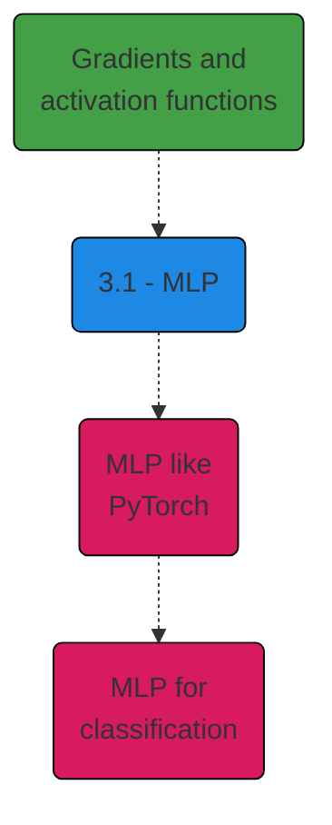

# Multilayer Perceptron

```mermaid
---

---
flowchart TD
    c1(3.1 - MLP)
    m1(Gradients and
activation functions)
    v1(MLP like
PyTorch)
    v2(MLP for
classification)

m1:::math -.-> c1

c1:::model -.-> v1
v1:::variation -.-> v2:::variation

classDef model fill:#1E88E5,stroke:#000,stroke-width:1px
classDef math fill:#43A047,stroke:#000,stroke-width:1px
classDef variation fill:#D81B60,stroke:#000,stroke-width:1px
```
